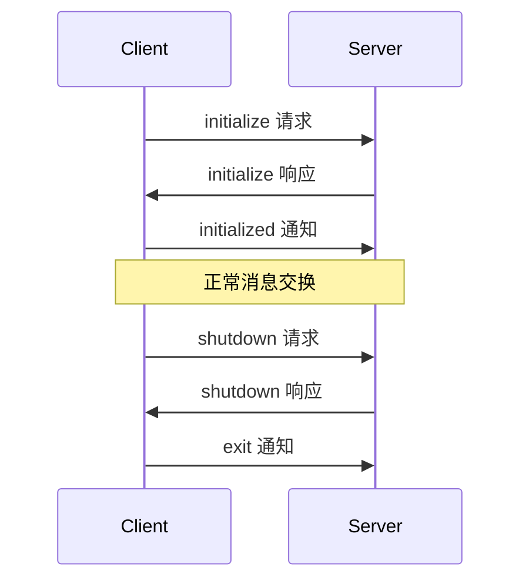

Model Context Protocol (MCP) 服务器实现了一系列标准化的 API 路由，用于客户端通信和功能实现。本文档详细介绍这些路由及其数据结构。

## 概述

MCP 服务器通过 JSON-RPC 2.0 协议提供以下类型的 API 路由：

1. **基础协议路由**：用于连接初始化和生命周期管理
2. **服务器功能路由**：包括资源、工具和提示词管理
3. **客户端功能路由**：处理根目录和采样等客户端特性
4. **实用工具路由**：提供补全、日志记录等辅助功能

每个路由都使用标准的 JSON-RPC 消息格式：

```typescript
// 请求消息格式
interface Request {
  jsonrpc: "2.0";
  id: number | string;
  method: string;
  params?: object;
}

// 响应消息格式
interface Response {
  jsonrpc: "2.0";
  id: number | string;
  result?: object;
  error?: {
    code: number;
    message: string;
    data?: unknown;
  };
}

// 通知消息格式
interface Notification {
  jsonrpc: "2.0";
  method: string;
  params?: object;
}
```

## 传输协议

MCP 支持两种主要的传输协议：

1. **标准输入/输出 (stdio)**：
   - 适用于本地进程通信
   - 使用标准输入和输出流
   - 主要用于命令行工具和本地集成

2. **HTTP 与 SSE**：
   - 使用 HTTP POST 进行客户端到服务器的通信
   - 使用 Server-Sent Events (SSE) 进行服务器到客户端的流式传输
   - 适用于网络通信和远程集成

每个路由的具体实现可能因传输协议而略有不同，但基本的请求/响应结构保持一致。

## 路由类别

### 基础协议路由

基础协议路由用于建立和维护客户端与服务器之间的连接：

1. 初始化路由
2. 生命周期管理路由
3. 错误处理路由

### 服务器功能路由

服务器功能路由提供核心 MCP 功能：

1. 资源管理路由
   - 资源列表
   - 资源获取
   - 资源监控

2. 工具执行路由
   - 工具列表
   - 工具执行
   - 执行状态

3. 提示词管理路由
   - 提示词列表
   - 提示词应用
   - 模板管理

### 客户端功能路由

客户端功能路由处理客户端特定的功能：

1. 根目录管理路由
   - 设置根目录
   - 更新根目录
   - 根目录监控

2. 采样接口路由
   - 采样请求
   - 采样控制
   - 结果处理

### 实用工具路由

实用工具路由提供辅助功能：

1. 补全路由
2. 日志记录路由
3. 分页处理路由

## 安全考虑

在实现 MCP 服务器路由时，需要考虑以下安全因素：

1. **认证和授权**
   - 实现适当的认证机制
   - 验证客户端凭据
   - 执行授权检查

2. **数据安全**
   - 使用 TLS 加密传输
   - 验证消息完整性
   - 实现速率限制

3. **错误处理**
   - 安全地处理错误
   - 避免敏感信息泄露
   - 实现适当的日志记录

## 性能考虑

在使用 MCP 服务器路由时，需要注意以下性能因素：

1. **连接管理**
   - 适当处理连接生命周期
   - 实现连接池（如适用）
   - 处理连接超时

2. **资源利用**
   - 监控资源使用
   - 实现适当的缓存策略
   - 处理大型消息和流数据

3. **错误恢复**
   - 实现重试机制
   - 处理网络中断
   - 管理服务降级

## 调试和监控

为了有效调试和监控 MCP 服务器路由：

1. **日志记录**
   - 记录请求和响应
   - 跟踪错误和异常
   - 监控性能指标

2. **健康检查**
   - 实现健康检查端点
   - 监控服务状态
   - 跟踪资源使用

3. **故障排除**
   - 提供详细的错误信息
   - 实现调试模式
   - 支持问题诊断

在接下来的章节中，我们将详细介绍每个具体路由的实现细节、数据结构和使用示例。

## 基础协议路由详解

### 初始化路由

#### initialize
- 方法：`initialize`
- 类型：请求/响应
- 描述：用于建立客户端和服务器之间的初始连接，协商协议版本和功能。

请求数据结构：
```typescript
interface InitializeRequest {
  protocolVersion: string;
  capabilities?: {
    resources?: ResourcesCapability;
    tools?: ToolsCapability;
    prompts?: PromptsCapability;
  };
}
```

响应数据结构：
```typescript
interface InitializeResponse {
  protocolVersion: string;
  capabilities: {
    resources?: ResourcesCapability;
    tools?: ToolsCapability;
    prompts?: PromptsCapability;
  };
}
```

示例：
```typescript
// 客户端请求
{
  "jsonrpc": "2.0",
  "id": 1,
  "method": "initialize",
  "params": {
    "protocolVersion": "2024-11-05",
    "capabilities": {
      "resources": {},
      "tools": {}
    }
  }
}

// 服务器响应
{
  "jsonrpc": "2.0",
  "id": 1,
  "result": {
    "protocolVersion": "2024-11-05",
    "capabilities": {
      "resources": {},
      "tools": {}
    }
  }
}
```

#### initialized
- 方法：`initialized`
- 类型：通知
- 描述：客户端发送此通知以确认初始化完成。

数据结构：
```typescript
interface InitializedNotification {
  // 无参数
}
```

示例：
```typescript
// 客户端通知
{
  "jsonrpc": "2.0",
  "method": "initialized"
}
```

### 生命周期管理路由

#### shutdown
- 方法：`shutdown`
- 类型：请求/响应
- 描述：请求服务器准备关闭。

请求数据结构：
```typescript
interface ShutdownRequest {
  // 无参数
}
```

响应数据结构：
```typescript
interface ShutdownResponse {
  // 无结果
}
```

示例：
```typescript
// 客户端请求
{
  "jsonrpc": "2.0",
  "id": 2,
  "method": "shutdown"
}

// 服务器响应
{
  "jsonrpc": "2.0",
  "id": 2,
  "result": null
}
```

#### exit
- 方法：`exit`
- 类型：通知
- 描述：通知服务器立即终止。

数据结构：
```typescript
interface ExitNotification {
  // 无参数
}
```

示例：
```typescript
// 客户端通知
{
  "jsonrpc": "2.0",
  "method": "exit"
}
```

### 连接序列

初始化和关闭的典型消息序列如下：



### 错误处理

初始化过程中的常见错误：

1. **协议版本不兼容**
```typescript
{
  "jsonrpc": "2.0",
  "id": 1,
  "error": {
    "code": -32600,
    "message": "不支持的协议版本"
  }
}
```

2. **功能不支持**
```typescript
{
  "jsonrpc": "2.0",
  "id": 1,
  "error": {
    "code": -32601,
    "message": "请求的功能不受支持"
  }
}
```

## 服务器功能路由

### 资源路由

资源路由用于管理和访问服务器提供的数据。资源是 application-controlled（由应用程序控制）的，这意味着客户端应用程序负责管理资源的生命周期。

#### resources/list
- 方法：`resources/list`
- 类型：请求/响应
- 描述：获取可用资源列表，支持分页。

请求数据结构：
```typescript
interface ListResourcesRequest {
  cursor?: string;  // 可选的分页游标
  query?: string;   // 可选的搜索查询
}
```

响应数据结构：
```typescript
interface ListResourcesResponse {
  resources: Resource[];
  nextCursor?: string;
}

interface Resource {
  uri: string;        // 资源的唯一标识符
  name?: string;      // 可选的显示名称
  mimeType: string;   // 资源的 MIME 类型
  metadata?: {        // 可选的元数据
    [key: string]: unknown;
  };
}
```

示例：
```typescript
// 客户端请求
{
  "jsonrpc": "2.0",
  "id": 3,
  "method": "resources/list",
  "params": {
    "query": "*.py"
  }
}

// 服务器响应
{
  "jsonrpc": "2.0",
  "id": 3,
  "result": {
    "resources": [
      {
        "uri": "file:///path/to/example.py",
        "name": "示例 Python 文件",
        "mimeType": "text/x-python",
        "metadata": {
          "lastModified": "2024-01-20T10:00:00Z",
          "size": 1024
        }
      }
    ]
  }
}
```

#### resources/get
- 方法：`resources/get`
- 类型：请求/响应
- 描述：获取特定资源的内容。支持部分内容获取。

请求数据结构：
```typescript
interface GetResourceRequest {
  uri: string;           // 资源的 URI
  range?: {             // 可选的范围请求
    start?: number;     // 起始位置（字节）
    end?: number;       // 结束位置（字节）
  };
}
```

响应数据结构：
```typescript
interface GetResourceResponse {
  mimeType: string;     // 资源的 MIME 类型
  content: string;      // 文本内容或 base64 编码的二进制数据
  metadata?: {          // 可选的元数据
    [key: string]: unknown;
  };
  range?: {            // 如果是部分响应
    start: number;
    end: number;
    total: number;
  };
}
```

示例：
```typescript
// 客户端请求
{
  "jsonrpc": "2.0",
  "id": 4,
  "method": "resources/get",
  "params": {
    "uri": "file:///path/to/example.py",
    "range": {
      "start": 0,
      "end": 1000
    }
  }
}

// 服务器响应
{
  "jsonrpc": "2.0",
  "id": 4,
  "result": {
    "mimeType": "text/x-python",
    "content": "def hello():\n    print('world')",
    "metadata": {
      "lastModified": "2024-01-20T10:00:00Z"
    },
    "range": {
      "start": 0,
      "end": 31,
      "total": 31
    }
  }
}
```

#### notifications/resources/changed
- 方法：`notifications/resources/changed`
- 类型：通知
- 描述：当资源发生变化时发送的通知。

数据结构：
```typescript
interface ResourceChangedNotification {
  changes: ResourceChange[];
}

interface ResourceChange {
  type: "created" | "modified" | "deleted";
  uri: string;
  resource?: Resource;  // 对于 created 和 modified
}
```

示例：
```typescript
// 服务器通知
{
  "jsonrpc": "2.0",
  "method": "notifications/resources/changed",
  "params": {
    "changes": [
      {
        "type": "modified",
        "uri": "file:///path/to/example.py",
        "resource": {
          "uri": "file:///path/to/example.py",
          "name": "更新的 Python 文件",
          "mimeType": "text/x-python"
        }
      }
    ]
  }
}
```

服务器在初始化时应声明 `resources` 功能：
```typescript
{
  "capabilities": {
    "resources": {
      "changeNotifications": true  // 是否支持资源变化通知
    }
  }
}
```

### 工具路由

工具路由用于执行服务器提供的功能。工具是 model-controlled（由模型控制）的，这意味着语言模型可以根据上下文理解和用户提示自动发现和调用工具。

#### tools/list
- 方法：`tools/list`
- 类型：请求/响应
- 描述：获取可用工具列表，支持分页。

请求数据结构：
```typescript
interface ListToolsRequest {
  cursor?: string;  // 可选的分页游标
}
```

响应数据结构：
```typescript
interface ListToolsResponse {
  tools: Tool[];
  nextCursor?: string;  // 下一页的游标
}

interface Tool {
  name: string;        // 工具的唯一标识符
  description: string; // 功能的人类可读描述
  inputSchema: {       // JSON Schema 定义的参数
    type: string;
    properties: {
      [key: string]: {
        type: string;
        description: string;
      };
    };
    required?: string[];
  };
}
```

示例：
```typescript
// 客户端请求
{
  "jsonrpc": "2.0",
  "id": 6,
  "method": "listTools"
}

// 服务器响应
{
  "jsonrpc": "2.0",
  "id": 6,
  "result": {
    "tools": [
      {
        "name": "get-weather",
        "description": "获取天气信息",
        "parameters": [
          {
            "name": "location",
            "type": "string",
            "description": "位置",
            "required": true
          }
        ],
        "returnType": "string"
      }
    ]
  }
}
```

#### tools/call
- 方法：`tools/call`
- 类型：请求/响应
- 描述：执行指定的工具，支持进度报告和取消。

请求数据结构：
```typescript
interface CallToolRequest {
  name: string;           // 工具的唯一标识符
  input: unknown;         // 符合工具 inputSchema 的参数
  progressToken?: string; // 可选的进度令牌
}
```

响应数据结构：
```typescript
interface CallToolResponse {
  result: unknown;        // 工具执行的结果
  error?: {              // 如果执行失败
    code: number;
    message: string;
    data?: unknown;
  };
}
```

示例：
```typescript
// 客户端请求
{
  "jsonrpc": "2.0",
  "id": 7,
  "method": "tools/call",
  "params": {
    "name": "get-weather",
    "input": {
      "location": "北京"
    },
    "progressToken": "progress_123"
  }
}

// 服务器响应
{
  "jsonrpc": "2.0",
  "id": 7,
  "result": {
    "result": "晴天，温度 25°C"
  }
}

// 错误响应示例
{
  "jsonrpc": "2.0",
  "id": 7,
  "error": {
    "code": -32101,
    "message": "工具执行失败",
    "data": {
      "reason": "API 请求超时"
    }
  }
}
```

工具执行期间可能会发送进度通知：
```typescript
// 进度通知
{
  "jsonrpc": "2.0",
  "method": "$/progress",
  "params": {
    "token": "progress_123",
    "value": {
      "percentage": 50,
      "message": "正在获取天气数据..."
    }
  }
}
```

### 提示词路由

提示词路由用于管理和应用提示词模板。提示词是 user-controlled（由用户控制）的，这意味着用户可以显式地选择和使用它们。

#### prompts/list
- 方法：`prompts/list`
- 类型：请求/响应
- 描述：获取可用提示词模板列表，支持分页。

请求数据结构：
```typescript
interface ListPromptsRequest {
  cursor?: string;  // 可选的分页游标
}
```

响应数据结构：
```typescript
interface ListPromptsResponse {
  prompts: Prompt[];
  nextCursor?: string;
}

interface Prompt {
  name: string;        // 提示词的唯一标识符
  description?: string; // 可选的人类可读描述
  arguments?: Argument[]; // 可选的参数列表
}

interface Argument {
  name: string;
  description?: string;
  required: boolean;
}
```

示例：
```typescript
// 客户端请求
{
  "jsonrpc": "2.0",
  "id": 8,
  "method": "prompts/list",
  "params": {
    "cursor": "optional-cursor-value"
  }
}

// 服务器响应
{
  "jsonrpc": "2.0",
  "id": 8,
  "result": {
    "prompts": [
      {
        "name": "code_review",
        "description": "分析代码质量并提出改进建议",
        "arguments": [
          {
            "name": "code",
            "description": "要审查的代码",
            "required": true
          }
        ]
      }
    ],
    "nextCursor": "next-page-cursor"
  }
}
```

#### prompts/get
- 方法：`prompts/get`
- 类型：请求/响应
- 描述：获取特定提示词的内容。参数可以通过补全 API 自动完成。

请求数据结构：
```typescript
interface GetPromptRequest {
  name: string;
  arguments: { [key: string]: unknown };
}
```

响应数据结构：
```typescript
interface GetPromptResponse {
  description?: string;
  messages: PromptMessage[];
}

interface PromptMessage {
  role: "user" | "assistant";
  content: TextContent | ImageContent | ResourceContent;
}

interface TextContent {
  type: "text";
  text: string;
}

interface ImageContent {
  type: "image";
  data: string;       // base64 编码的图片数据
  mimeType: string;   // 如 "image/png"
}

interface ResourceContent {
  type: "resource";
  resource: {
    uri: string;
    mimeType: string;
    text?: string;    // 文本内容
    data?: string;    // base64 编码的二进制数据
  };
}
```

示例：
```typescript
// 客户端请求
{
  "jsonrpc": "2.0",
  "id": 9,
  "method": "prompts/get",
  "params": {
    "name": "code_review",
    "arguments": {
      "code": "def hello():\n    print('world')"
    }
  }
}

// 服务器响应
{
  "jsonrpc": "2.0",
  "id": 9,
  "result": {
    "description": "代码审查提示词",
    "messages": [
      {
        "role": "user",
        "content": {
          "type": "text",
          "text": "请审查这段 Python 代码：\ndef hello():\n    print('world')"
        }
      }
    ]
  }
}
```

#### notifications/prompts/list_changed
- 方法：`notifications/prompts/list_changed`
- 类型：通知
- 描述：当可用提示词列表发生变化时发送的通知。

示例：
```typescript
// 服务器通知
{
  "jsonrpc": "2.0",
  "method": "notifications/prompts/list_changed"
}
```

服务器在初始化时应声明 `prompts` 功能：
```typescript
{
  "capabilities": {
    "prompts": {
      "listChanged": true  // 是否支持列表变化通知
    }
  }
}
```

## 客户端功能路由

### 根目录路由

根目录路由用于管理服务器可访问的资源位置。

#### setRoots
- 方法：`setRoots`
- 类型：通知
- 描述：设置服务器可访问的根目录列表。

数据结构：
```typescript
interface SetRootsNotification {
  roots: Root[];
}

interface Root {
  uri: string;
  name?: string;
}
```

示例：
```typescript
// 客户端通知
{
  "jsonrpc": "2.0",
  "method": "setRoots",
  "params": {
    "roots": [
      {
        "uri": "file:///home/user/project",
        "name": "项目目录"
      },
      {
        "uri": "https://api.example.com",
        "name": "API 端点"
      }
    ]
  }
}
```

#### updateRoots
- 方法：`updateRoots`
- 类型：通知
- 描述：更新现有的根目录列表。

数据结构：
```typescript
interface UpdateRootsNotification {
  added?: Root[];
  removed?: string[];  // URIs of roots to remove
}
```

示例：
```typescript
// 客户端通知
{
  "jsonrpc": "2.0",
  "method": "updateRoots",
  "params": {
    "added": [
      {
        "uri": "file:///home/user/new-project",
        "name": "新项目目录"
      }
    ],
    "removed": [
      "file:///home/user/old-project"
    ]
  }
}
```

### 采样接口路由

采样接口路由用于从 LLM 请求文本补全。

#### sample
- 方法：`sample`
- 类型：请求/响应
- 描述：从 LLM 请求文本补全。

请求数据结构：
```typescript
interface SampleRequest {
  prompt: string;
  options?: {
    maxTokens?: number;
    temperature?: number;
    topP?: number;
    stop?: string[];
  };
}
```

响应数据结构：
```typescript
interface SampleResponse {
  completion: string;
  usage?: {
    promptTokens: number;
    completionTokens: number;
    totalTokens: number;
  };
}
```

示例：
```typescript
// 客户端请求
{
  "jsonrpc": "2.0",
  "id": 10,
  "method": "sample",
  "params": {
    "prompt": "将以下文本翻译成英文：你好，世界！",
    "options": {
      "maxTokens": 100,
      "temperature": 0.7
    }
  }
}

// 服务器响应
{
  "jsonrpc": "2.0",
  "id": 10,
  "result": {
    "completion": "Hello, world!",
    "usage": {
      "promptTokens": 15,
      "completionTokens": 3,
      "totalTokens": 18
    }
  }
}
```

#### cancelSample
- 方法：`cancelSample`
- 类型：通知
- 描述：取消正在进行的采样请求。

数据结构：
```typescript
interface CancelSampleNotification {
  requestId: string | number;  // 要取消的采样请求的 ID
}
```

示例：
```typescript
// 客户端通知
{
  "jsonrpc": "2.0",
  "method": "cancelSample",
  "params": {
    "requestId": 10
  }
}
```

## 实用工具路由

### 补全路由

补全路由用于处理 LLM 生成的文本。

#### complete
- 方法：`complete`
- 类型：请求/响应
- 描述：请求 LLM 生成文本补全。

请求数据结构：
```typescript
interface CompleteRequest {
  prompt: string;
  options?: {
    maxTokens?: number;
    temperature?: number;
    topP?: number;
    stop?: string[];
  };
}
```

响应数据结构：
```typescript
interface CompleteResponse {
  completion: string;
  usage?: {
    promptTokens: number;
    completionTokens: number;
    totalTokens: number;
  };
}
```

示例：
```typescript
// 客户端请求
{
  "jsonrpc": "2.0",
  "id": 11,
  "method": "complete",
  "params": {
    "prompt": "继续这个句子：人工智能将...",
    "options": {
      "maxTokens": 50,
      "temperature": 0.7
    }
  }
}

// 服务器响应
{
  "jsonrpc": "2.0",
  "id": 11,
  "result": {
    "completion": "改变我们的生活方式和工作方式。",
    "usage": {
      "promptTokens": 10,
      "completionTokens": 12,
      "totalTokens": 22
    }
  }
}
```

### 日志路由

日志路由用于记录和检索服务器日志。

#### log
- 方法：`log`
- 类型：通知
- 描述：记录日志消息。

数据结构：
```typescript
interface LogNotification {
  level: "debug" | "info" | "warn" | "error";
  message: string;
  data?: unknown;
}
```

示例：
```typescript
// 客户端通知
{
  "jsonrpc": "2.0",
  "method": "log",
  "params": {
    "level": "info",
    "message": "工具执行完成",
    "data": {
      "toolName": "get-weather",
      "duration": 123
    }
  }
}
```

### 分页路由

分页路由用于处理大量数据的分页请求。

#### getPage
- 方法：`getPage`
- 类型：请求/响应
- 描述：获取分页数据。

请求数据结构：
```typescript
interface GetPageRequest {
  pageToken: string;
}
```

响应数据结构：
```typescript
interface GetPageResponse {
  items: unknown[];
  nextPageToken?: string;
}
```

示例：
```typescript
// 客户端请求
{
  "jsonrpc": "2.0",
  "id": 12,
  "method": "getPage",
  "params": {
    "pageToken": "next_page_token_123"
  }
}

// 服务器响应
{
  "jsonrpc": "2.0",
  "id": 12,
  "result": {
    "items": [
      // 分页数据项...
    ],
    "nextPageToken": "next_page_token_124"
  }
}
```

## 错误处理

MCP 使用标准的 JSON-RPC 错误代码和自定义错误代码来处理各种错误情况。

### 标准错误代码

```typescript
enum ErrorCode {
  // 标准 JSON-RPC 错误
  ParseError = -32700,      // 无效的 JSON
  InvalidRequest = -32600,  // 无效的请求对象
  MethodNotFound = -32601,  // 方法不存在
  InvalidParams = -32602,   // 无效的方法参数
  InternalError = -32603    // 内部错误
}
```

### MCP 特定错误代码

```typescript
enum McpErrorCode {
  // 资源错误
  ResourceNotFound = -32000,        // 请求的资源不存在
  ResourceAccessDenied = -32001,    // 无权访问资源
  ResourceInvalidUri = -32002,      // 无效的资源 URI

  // 工具错误
  ToolNotFound = -32100,            // 请求的工具不存在
  ToolExecutionFailed = -32101,     // 工具执行失败
  ToolInvalidParams = -32102,       // 无效的工具参数

  // 提示词错误
  PromptNotFound = -32200,          // 请求的提示词不存在
  PromptInvalidParams = -32201,     // 无效的提示词参数

  // 采样错误
  SampleFailed = -32300,            // 采样请求失败
  SampleCancelled = -32301,         // 采样请求被取消

  // 其他错误
  CapabilityNotSupported = -32400,  // 请求的功能不受支持
  InvalidProtocolVersion = -32401   // 不支持的协议版本
}
```

### 错误响应示例

1. **解析错误**
```typescript
{
  "jsonrpc": "2.0",
  "id": null,
  "error": {
    "code": -32700,
    "message": "无效的 JSON：意外的结束"
  }
}
```

2. **资源不存在**
```typescript
{
  "jsonrpc": "2.0",
  "id": 13,
  "error": {
    "code": -32000,
    "message": "资源不存在",
    "data": {
      "uri": "file:///path/to/missing/resource"
    }
  }
}
```

3. **工具执行失败**
```typescript
{
  "jsonrpc": "2.0",
  "id": 14,
  "error": {
    "code": -32101,
    "message": "工具执行失败",
    "data": {
      "toolName": "get-weather",
      "reason": "API 请求超时"
    }
  }
}
```

4. **无效参数**
```typescript
{
  "jsonrpc": "2.0",
  "id": 15,
  "error": {
    "code": -32602,
    "message": "无效的参数",
    "data": {
      "validation": [
        {
          "field": "maxTokens",
          "error": "必须是正整数"
        }
      ]
    }
  }
}
```

### 错误处理最佳实践

1. **错误分类**
- 使用适当的错误代码
- 提供清晰的错误消息
- 包含相关的错误数据

2. **错误恢复**
- 实现适当的重试机制
- 提供回退选项
- 保持系统稳定性

3. **错误报告**
- 记录详细的错误信息
- 包含调试所需的上下文
- 避免暴露敏感信息
