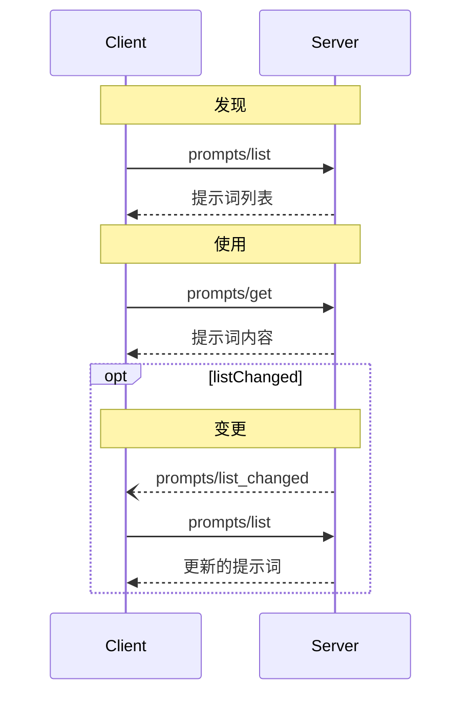

Prompts 使服务器能够定义可重用的提示词模板和工作流，客户端可以轻松地将其呈现给用户和 LLM。它们提供了一种强大的方式来标准化和共享常见的 LLM 交互。

<Note>
  Prompts 设计为**用户可控**，这意味着它们从服务器暴露给客户端时，用户可以明确选择使用它们。
</Note>

## 概述

MCP 中的 prompts 是预定义的模板，可以：
- 接受动态参数
- 包含来自 resources 的上下文
- 链接多个交互
- 引导特定工作流
- 作为 UI 元素呈现（如斜杠命令）

## Prompt 结构

每个 prompt 的定义包含：

```typescript
{
  name: string;              // 唯一标识符
  description?: string;      // 人类可读的描述
  arguments?: [              // 可选的参数列表
    {
      name: string;          // 参数标识符
      description?: string;  // 参数描述
      required?: boolean;    // 参数是否必需
    }
  ]
}
```

## 发现 Prompts

客户端可以通过 `prompts/list` 端点发现可用的 prompts：

```typescript
// 请求
{
  method: "prompts/list"
}

// 响应
{
  prompts: [
    {
      name: "analyze-code",
      description: "分析代码以寻找潜在改进",
      arguments: [
        {
          name: "language",
          description: "编程语言",
          required: true
        }
      ]
    }
  ]
}
```

## 使用 Prompts

要使用 prompt，客户端需要发送 `prompts/get` 请求：

```typescript
// 请求
{
  method: "prompts/get",
  params: {
    name: "analyze-code",
    arguments: {
      language: "python"
    }
  }
}

// 响应
{
  description: "分析 Python 代码以寻找潜在改进",
  messages: [
    {
      role: "user",
      content: {
        type: "text",
        text: "请分析以下 Python 代码以寻找潜在改进：\n\n```python\ndef calculate_sum(numbers):\n    total = 0\n    for num in numbers:\n        total = total + num\n    return total\n\nresult = calculate_sum([1, 2, 3, 4, 5])\nprint(result)\n```"
      }
    }
  ]
}
```

## 动态 Prompts

Prompts 可以是动态的，包括：

### 嵌入的资源上下文

```json
{
  "name": "analyze-project",
  "description": "分析项目日志和代码",
  "arguments": [
    {
      "name": "timeframe",
      "description": "分析日志的时间段",
      "required": true
    },
    {
      "name": "fileUri",
      "description": "要审查的代码文件的 URI",
      "required": true
    }
  ]
}
```

处理 `prompts/get` 请求时：

```json
{
  "messages": [
    {
      "role": "user",
      "content": {
        "type": "text",
        "text": "分析这些系统日志和代码文件是否存在任何问题："
      }
    },
    {
      "role": "user",
      "content": {
        "type": "resource",
        "resource": {
          "uri": "logs://recent?timeframe=1h",
          "text": "[2024-03-14 15:32:11] ERROR: Connection timeout in network.py:127\n[2024-03-14 15:32:15] WARN: Retrying connection (attempt 2/3)\n[2024-03-14 15:32:20] ERROR: Max retries exceeded",
          "mimeType": "text/plain"
        }
      }
    },
    {
      "role": "user",
      "content": {
        "type": "resource",
        "resource": {
          "uri": "file:///path/to/code.py",
          "text": "def connect_to_service(timeout=30):\n    retries = 3\n    for attempt in range(retries):\n        try:\n            return establish_connection(timeout)\n        except TimeoutError:\n            if attempt == retries - 1:\n                raise\n            time.sleep(5)\n\ndef establish_connection(timeout):\n    # Connection implementation\n    pass",
          "mimeType": "text/x-python"
        }
      }
    }
  ]
}
```

### 多步骤工作流

```typescript
const debugWorkflow = {
  name: "debug-error",
  async getMessages(error: string) {
    return [
      {
        role: "user",
        content: {
          type: "text",
          text: `这是我遇到的错误：${error}`
        }
      },
      {
        role: "assistant",
        content: {
          type: "text",
          text: "我来帮你分析这个错误。到目前为止你尝试过什么？"
        }
      },
      {
        role: "user",
        content: {
          type: "text",
          text: "我尝试过重启服务，但错误仍然存在。"
        }
      }
    ];
  }
};
```

## 实现示例

这是在 MCP 服务器中实现 prompts 的完整示例：

<Tabs>
  <Tab title="TypeScript">
    ```typescript
    import { Server } from "@modelcontextprotocol/sdk/server";
    import {
      ListPromptsRequestSchema,
      GetPromptRequestSchema
    } from "@modelcontextprotocol/sdk/types";

    const PROMPTS = {
      "git-commit": {
        name: "git-commit",
        description: "生成 Git 提交消息",
        arguments: [
          {
            name: "changes",
            description: "Git diff 或更改描述",
            required: true
          }
        ]
      },
      "explain-code": {
        name: "explain-code",
        description: "解释代码的工作原理",
        arguments: [
          {
            name: "code",
            description: "要解释的代码",
            required: true
          },
          {
            name: "language",
            description: "编程语言",
            required: false
          }
        ]
      }
    };

    const server = new Server({
      name: "example-prompts-server",
      version: "1.0.0"
    }, {
      capabilities: {
        prompts: {}
      }
    });

    // 列出可用的 prompts
    server.setRequestHandler(ListPromptsRequestSchema, async () => {
      return {
        prompts: Object.values(PROMPTS)
      };
    });

    // 获取特定的 prompt
    server.setRequestHandler(GetPromptRequestSchema, async (request) => {
      const prompt = PROMPTS[request.params.name];
      if (!prompt) {
        throw new Error(`未找到 prompt：${request.params.name}`);
      }

      if (request.params.name === "git-commit") {
        return {
          messages: [
            {
              role: "user",
              content: {
                type: "text",
                text: `为这些更改生成一个简洁但描述性的提交消息：\n\n${request.params.arguments?.changes}`
              }
            }
          ]
        };
      }

      if (request.params.name === "explain-code") {
        const language = request.params.arguments?.language || "未知";
        return {
          messages: [
            {
              role: "user",
              content: {
                type: "text",
                text: `解释这段 ${language} 代码是如何工作的：\n\n${request.params.arguments?.code}`
              }
            }
          ]
        };
      }

      throw new Error("未找到 prompt 实现");
    });
    ```
  </Tab>
  <Tab title="Python">
    ```python
    from mcp.server import Server
    import mcp.types as types

    # 定义可用的 prompts
    PROMPTS = {
        "git-commit": types.Prompt(
            name="git-commit",
            description="生成 Git 提交消息",
            arguments=[
                types.PromptArgument(
                    name="changes",
                    description="Git diff 或更改描述",
                    required=True
                )
            ],
        ),
        "explain-code": types.Prompt(
            name="explain-code",
            description="解释代码的工作原理",
            arguments=[
                types.PromptArgument(
                    name="code",
                    description="要解释的代码",
                    required=True
                ),
                types.PromptArgument(
                    name="language",
                    description="编程语言",
                    required=False
                )
            ],
        )
    }

    # 初始化服务器
    app = Server("example-prompts-server")

    @app.list_prompts()
    async def list_prompts() -> list[types.Prompt]:
        return list(PROMPTS.values())

    @app.get_prompt()
    async def get_prompt(
        name: str, arguments: dict[str, str] | None = None
    ) -> types.GetPromptResult:
        if name not in PROMPTS:
            raise ValueError(f"未找到 prompt：{name}")

        if name == "git-commit":
            changes = arguments.get("changes") if arguments else ""
            return types.GetPromptResult(
                messages=[
                    types.PromptMessage(
                        role="user",
                        content=types.TextContent(
                            type="text",
                            text=f"为这些更改生成一个简洁但描述性的提交消息：\n\n{changes}"
                        )
                    )
                ]
            )

        if name == "explain-code":
            code = arguments.get("code") if arguments else ""
            language = arguments.get("language", "未知") if arguments else "未知"
            return types.GetPromptResult(
                messages=[
                    types.PromptMessage(
                        role="user",
                        content=types.TextContent(
                            type="text",
                            text=f"解释这段 {language} 代码是如何工作的：\n\n{code}"
                        )
                    )
                ]
            )

        raise ValueError("未找到 prompt 实现")
    ```
  </Tab>
</Tabs>

## 最佳实践

在实现 prompts 时：

1. 使用清晰、描述性的 prompt 名称
2. 为 prompts 和参数提供详细描述
3. 验证所有必需参数
4. 优雅地处理缺失参数
5. 考虑 prompt 模板的版本控制
6. 适当缓存动态内容
7. 实现错误处理
8. 记录预期的参数格式
9. 考虑 prompt 的可组合性
10. 使用各种输入测试 prompts

## UI 集成

Prompts 可以在客户端 UI 中呈现为：

- 斜杠命令
- 快速操作
- 上下文菜单项
- 命令面板条目
- 引导式工作流
- 交互式表单

## 更新和变更

服务器可以通知客户端关于 prompt 的变更：

1. 服务器功能：`prompts.listChanged`
2. 通知：`notifications/prompts/list_changed`
3. 客户端重新获取 prompt 列表

## 安全考虑

在实现 prompts 时：

- 验证所有参数
- 净化用户输入
- 考虑速率限制
- 实现访问控制
- 审计 prompt 使用情况
- 适当处理敏感数据
- 验证生成的内容
- 实现超时机制
- 考虑 prompt 注入风险
- 记录安全要求
---
title: 提示词
weight: 10
---

 **协议版本**: 


Model Context Protocol (MCP) 为服务器提供了一种标准化的方式来向客户端暴露提示词模板。Prompts 允许服务器提供结构化的消息和指令，用于与语言模型交互。客户端可以发现可用的提示词、检索其内容并提供参数来自定义它们。

## 用户交互模型

Prompts 被设计为 **user-controlled**（用户控制），这意味着它们从服务器暴露给客户端时，目的是让用户能够明确地选择使用它们。

通常，提示词会通过用户界面中的用户发起命令触发，这允许用户自然地发现和调用可用的提示词。

例如，作为斜杠命令：


然而，实现者可以自由地通过任何适合其需求的界面模式来暴露提示词——协议本身不强制要求特定的用户交互模型。

## 功能

支持提示词的服务器在 [初始化]() 期间 **MUST** 声明 `prompts` 功能：

```json
{
  "capabilities": {
    "prompts": {
      "listChanged": true
    }
  }
}
```

`listChanged` 表示服务器是否会在可用提示词列表发生变化时发出通知。

## 协议消息

### 列出提示词

要检索可用的提示词，客户端发送 `prompts/list` 请求。此操作支持 [分页]()。

**请求：**

```json
{
  "jsonrpc": "2.0",
  "id": 1,
  "method": "prompts/list",
  "params": {
    "cursor": "optional-cursor-value"
  }
}
```

**响应：**

```json
{
  "jsonrpc": "2.0",
  "id": 1,
  "result": {
    "prompts": [
      {
        "name": "code_review",
        "description": "要求 LLM 分析代码质量并提出改进建议",
        "arguments": [
          {
            "name": "code",
            "description": "要审查的代码",
            "required": true
          }
        ]
      }
    ],
    "nextCursor": "next-page-cursor"
  }
}
```

### 获取提示词

要检索特定提示词，客户端发送 `prompts/get` 请求。参数可以通过 [补全 API]() 自动完成。

**请求：**

```json
{
  "jsonrpc": "2.0",
  "id": 2,
  "method": "prompts/get",
  "params": {
    "name": "code_review",
    "arguments": {
      "code": "def hello():\n    print('world')"
    }
  }
}
```

**响应：**

```json
{
  "jsonrpc": "2.0",
  "id": 2,
  "result": {
    "description": "代码审查提示词",
    "messages": [
      {
        "role": "user",
        "content": {
          "type": "text",
          "text": "请审查这段 Python 代码：\ndef hello():\n    print('world')"
        }
      }
    ]
  }
}
```

### 列表变更通知

当可用提示词列表发生变化时，声明了 `listChanged` 功能的服务器 **SHOULD** 发送通知：

```json
{
  "jsonrpc": "2.0",
  "method": "notifications/prompts/list_changed"
}
```

## 消息流



## 数据类型

### Prompt

提示词定义包括：

- `name`：提示词的唯一标识符
- `description`：可选的人类可读描述
- `arguments`：可选的自定义参数列表

### PromptMessage

提示词中的消息可以包含：

- `role`："user" 或 "assistant" 以指示说话者
- `content`：以下内容类型之一：

#### Text Content

文本内容表示纯文本消息：

```json
{
  "type": "text",
  "text": "消息的文本内容"
}
```

这是用于自然语言交互的最常见内容类型。

#### Image Content

图像内容允许在消息中包含视觉信息：

```json
{
  "type": "image",
  "data": "base64-encoded-image-data",
  "mimeType": "image/png"
}
```

图像数据 **MUST** 是 base64 编码的，并包含有效的 MIME 类型。这使得在视觉上下文重要的场景中可以进行多模态交互。

#### Embedded Resources

嵌入式资源允许在消息中直接引用服务器端资源：

```json
{
  "type": "resource",
  "resource": {
    "uri": "resource://example",
    "mimeType": "text/plain",
    "text": "资源内容"
  }
}
```

资源可以包含文本或二进制（blob）数据，并且 **MUST** 包括：

- 有效的资源 URI
- 适当的 MIME 类型
- 文本内容或 base64 编码的 blob 数据

嵌入式资源使提示词能够无缝地将服务器管理的内容（如文档、代码示例或其他参考材料）直接整合到对话流程中。

## 错误处理

服务器 **SHOULD** 对常见故障情况返回标准的 JSON-RPC 错误：

- 无效的提示词名称：`-32602`（Invalid params）
- 缺少必需参数：`-32602`（Invalid params）
- 内部错误：`-32603`（Internal error）

## 实现注意事项

1. 服务器 **SHOULD** 在处理之前验证提示词参数
2. 客户端 **SHOULD** 处理大型提示词列表的分页
3. 双方 **SHOULD** 遵守功能协商

## 安全性

实现必须仔细验证所有提示词输入和输出，以防止注入攻击或未经授权访问资源。
