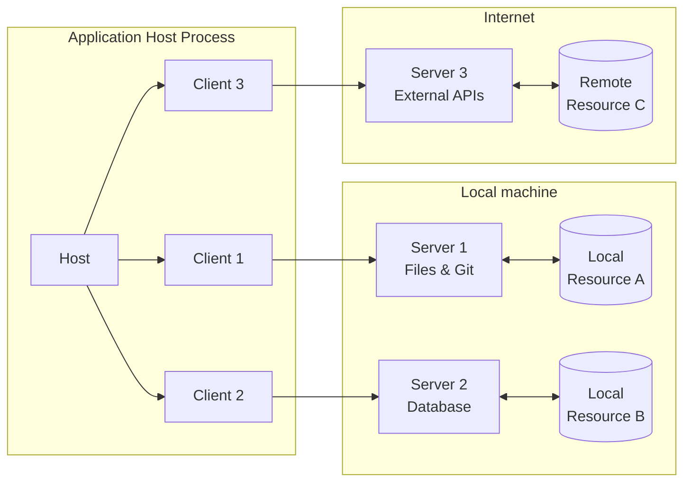
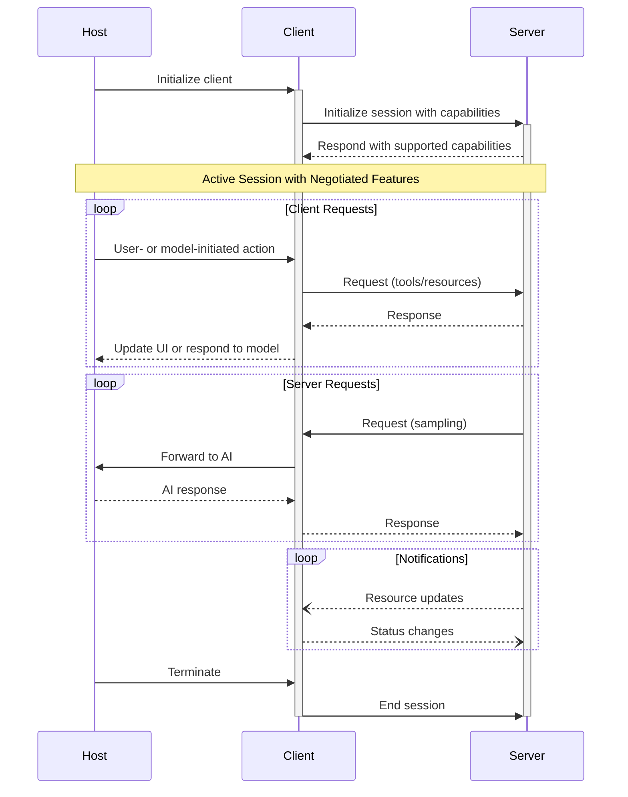

:::info
**协议版本**: 2024-11-05
:::

Model Context Protocol (MCP) 遵循客户端-主机-服务器架构，每个主机可以运行多个客户端实例。这种架构使用户能够跨应用程序集成 AI 功能，同时保持清晰的安全边界和关注点隔离。基于 JSON-RPC 构建，MCP 提供了一个有状态的会话协议，专注于客户端和服务器之间的上下文交换和采样协调。

## Core Components（核心组件）

### Host（主机）

主机进程作为容器和协调器：

- 创建和管理多个客户端实例
- 控制客户端连接权限和生命周期
- 执行安全策略和同意要求
- 处理用户授权决策
- 协调 AI/LLM 集成和采样
- 管理跨客户端的上下文聚合

### Clients（客户端）

每个客户端由主机创建并维护一个隔离的服务器连接：

- 为每个服务器建立一个有状态会话
- 处理协议协商和功能交换
- 双向路由协议消息
- 管理订阅和通知
- 维护服务器之间的安全边界

主机应用程序创建和管理多个客户端，每个客户端与特定服务器保持 1:1 关系。

### Servers（服务器）

服务器提供专门的上下文和功能：

- 通过 MCP 原语暴露资源、工具和提示词
- 独立运行，职责明确
- 通过客户端接口请求采样
- 必须尊重安全约束
- 可以是本地进程或远程服务

## Design Principles（设计原则）

MCP 建立在几个关键设计原则之上，这些原则指导其架构和实现：

1. 服务器应该非常容易构建
   - 主机应用程序处理复杂的编排职责
   - 服务器专注于特定、明确定义的功能
   - 简单的接口最小化实现开销
   - 清晰的分离实现可维护的代码

2. 服务器应该高度可组合
   - 每个服务器在隔离中提供专注的功能
   - 多个服务器可以无缝组合
   - 共享协议实现互操作性
   - 模块化设计支持可扩展性

3. 服务器不应该能够读取整个对话，也不能"看到"其他服务器
   - 服务器只接收必要的上下文信息
   - 完整的对话历史保留在主机
   - 每个服务器连接保持隔离
   - 跨服务器交互由主机控制
   - 主机进程执行安全边界

4. 可以逐步向服务器和客户端添加功能
   - 核心协议提供最小必需功能
   - 可以根据需要协商额外功能
   - 服务器和客户端独立演进
   - 协议设计考虑未来可扩展性
   - 保持向后兼容性

## Message Types（消息类型）

MCP 基于 [JSON-RPC 2.0](https://www.jsonrpc.org/specification) 定义了三种核心消息类型：

- Requests（请求）：双向消息，带有方法和参数，期望响应
- Responses（响应）：成功结果或与特定请求 ID 匹配的错误
- Notifications（通知）：不需要响应的单向消息

每种消息类型都遵循 JSON-RPC 2.0 规范的结构和传递语义。

## Capability Negotiation（功能协商）

Model Context Protocol 使用基于功能的协商系统，客户端和服务器在初始化期间明确声明其支持的功能。功能决定了会话期间可用的协议特性和原语。

- 服务器声明资源订阅、工具支持和提示词模板等功能
- 客户端声明采样支持和通知处理等功能
- 双方必须在整个会话期间尊重声明的功能
- 可以通过协议扩展协商额外功能

每个功能都解锁会话期间使用的特定协议功能。例如：

- 实现的[服务器功能](/docs/specification/server)必须在服务器的功能中公布
- 发出资源订阅通知需要服务器声明订阅支持
- 工具调用需要服务器声明工具功能
- [采样](/docs/specification/client)需要客户端在其功能中声明支持

这种功能协商确保客户端和服务器对支持的功能有清晰的理解，同时保持协议的可扩展性。
