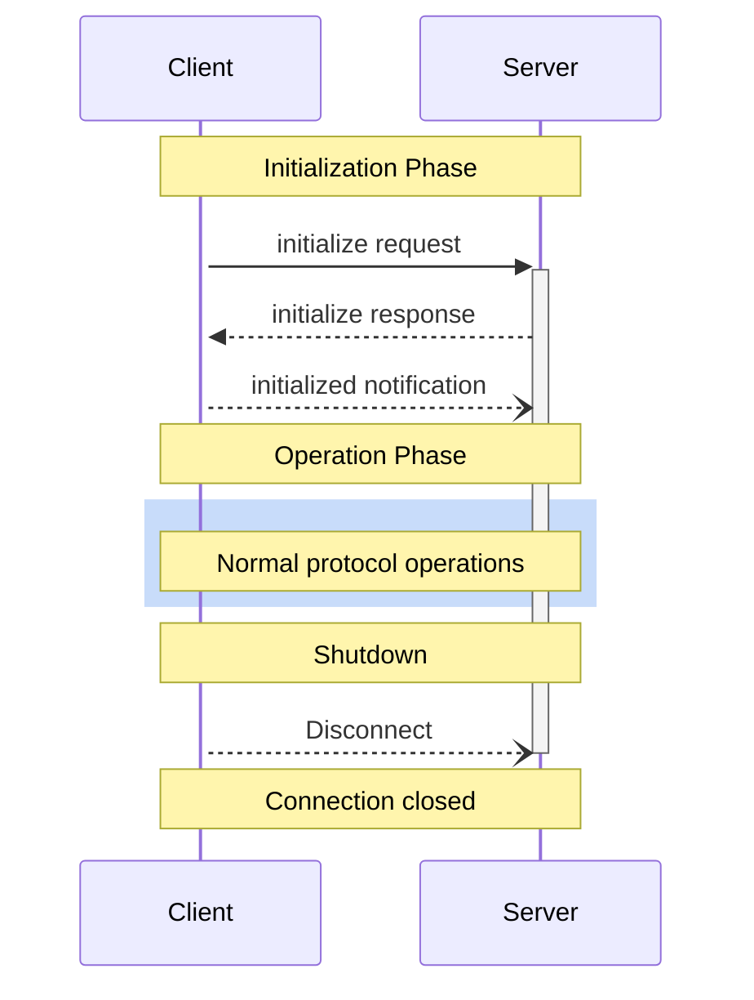

:::info
**协议版本**: 2024-11-05
:::

Model Context Protocol (MCP) 为客户端-服务器连接定义了一个严格的生命周期，以确保正确的功能协商和状态管理。

1. Initialization（初始化）：功能协商和协议版本协议
2. Operation（运行）：正常的协议通信
3. Shutdown（关闭）：连接的优雅终止



## 生命周期阶段

### Initialization（初始化）

初始化阶段必须（**MUST**）是客户端和服务器之间的第一次交互。
在此阶段，客户端和服务器：

- 建立协议版本兼容性
- 交换和协商功能
- 共享实现细节

客户端必须（**MUST**）通过发送 `initialize` 请求来启动此阶段，请求包含：

- 支持的协议版本
- 客户端功能
- 客户端实现信息

```json
{
  "jsonrpc": "2.0",
  "id": 1,
  "method": "initialize",
  "params": {
    "protocolVersion": "2024-11-05",
    "capabilities": {
      "roots": {
        "listChanged": true
      },
      "sampling": {}
    },
    "clientInfo": {
      "name": "ExampleClient",
      "version": "1.0.0"
    }
  }
}
```

服务器必须（**MUST**）响应其自身的功能和信息：

```json
{
  "jsonrpc": "2.0",
  "id": 1,
  "result": {
    "protocolVersion": "2024-11-05",
    "capabilities": {
      "logging": {},
      "prompts": {
        "listChanged": true
      },
      "resources": {
        "subscribe": true,
        "listChanged": true
      },
      "tools": {
        "listChanged": true
      }
    },
    "serverInfo": {
      "name": "ExampleServer",
      "version": "1.0.0"
    }
  }
}
```

初始化成功后，客户端必须（**MUST**）发送 `initialized` 通知以表明它已准备好开始正常操作：

```json
{
  "jsonrpc": "2.0",
  "method": "notifications/initialized"
}
```

- 在服务器响应 `initialize` 请求之前，客户端应该（**SHOULD**）不发送除了 [ping](/docs/specification/basic/utilities/ping) 之外的其他请求。
- 在收到 `initialized` 通知之前，服务器应该（**SHOULD**）不发送除了 [ping](/docs/specification/basic/utilities/ping) 和 [logging](/docs/specification/server/utilities/logging) 之外的其他请求。

#### 版本协商

在 `initialize` 请求中，客户端必须（**MUST**）发送它支持的协议版本。这应该（**SHOULD**）是客户端支持的*最新*版本。

如果服务器支持请求的协议版本，它必须（**MUST**）响应相同的版本。否则，服务器必须（**MUST**）响应它支持的另一个协议版本。这应该（**SHOULD**）是服务器支持的*最新*版本。

如果客户端不支持服务器响应中的版本，它应该（**SHOULD**）断开连接。

#### 功能协商

客户端和服务器功能确定了会话期间可用的可选协议特性。主要功能包括：

| 类别 | 功能 | 描述 |
|------|------|------|
| Client | `roots` | 提供文件系统 [roots](/docs/specification/client/roots) 的能力 |
| Client | `sampling` | 支持 LLM [sampling](/docs/specification/client/sampling) 请求 |
| Client | `experimental` | 描述对非标准实验性功能的支持 |
| Server | `prompts` | 提供 [prompt templates](/docs/specification/server/prompts) |
| Server | `resources` | 提供可读的 [resources](/docs/specification/server/resources) |
| Server | `tools` | 暴露可调用的 [tools](/docs/specification/server/tools) |
| Server | `logging` | 发出结构化的 [log messages](/docs/specification/server/utilities/logging) |
| Server | `experimental` | 描述对非标准实验性功能的支持 |

功能对象可以描述子功能，如：

- `listChanged`：支持列表更改通知（用于 prompts、resources 和 tools）
- `subscribe`：支持订阅单个项目的更改（仅限 resources）

### Operation（运行）

在运行阶段，客户端和服务器根据协商的功能交换消息。

双方应该（**SHOULD**）：
- 遵守协商的协议版本
- 仅使用成功协商的功能

### Shutdown（关闭）

在关闭阶段，一方（通常是客户端）干净地终止协议连接。没有定义特定的关闭消息——相反，应该使用底层传输机制来发出连接终止信号：

#### stdio

对于 stdio [transport](/docs/specification/basic/transports)，客户端应该（**SHOULD**）通过以下方式启动关闭：

1. 首先，关闭子进程（服务器）的输入流
2. 等待服务器退出，或者如果服务器在合理时间内没有退出，则发送 `SIGTERM`
3. 如果服务器在收到 `SIGTERM` 后的合理时间内没有退出，则发送 `SIGKILL`

服务器可以（**MAY**）通过关闭其到客户端的输出流并退出来启动关闭。

#### HTTP

对于 HTTP [transports](/docs/specification/basic/transports)，通过关闭相关的 HTTP 连接来指示关闭。

## 错误处理

实现应该（**SHOULD**）准备好处理这些错误情况：

- 协议版本不匹配
- 无法协商所需功能
- Initialize 请求超时
- Shutdown 超时

实现应该（**SHOULD**）为所有请求实现适当的超时，以防止连接挂起和资源耗尽。

初始化错误示例：

```json
{
  "jsonrpc": "2.0",
  "id": 1,
  "error": {
    "code": -32602,
    "message": "Unsupported protocol version",
    "data": {
      "supported": ["2024-11-05"],
      "requested": "1.0.0"
    }
  }
}
```
