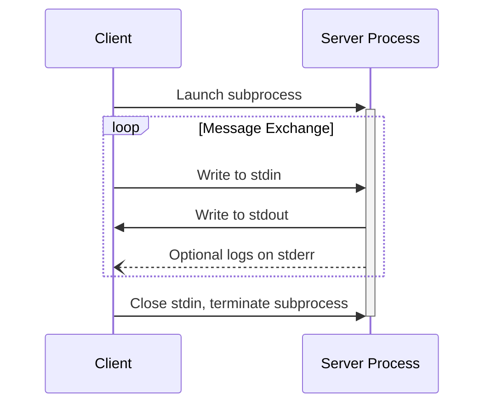
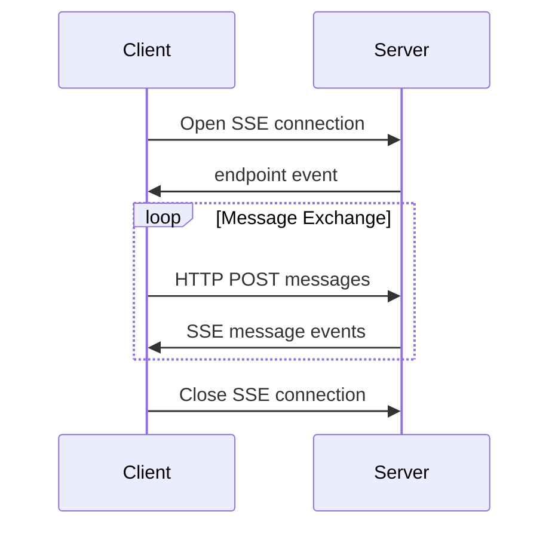

:::info
**协议版本**: 2024-11-05
:::

MCP 目前定义了两种标准传输机制用于客户端-服务器通信：

1. stdio，通过标准输入输出进行通信
2. [HTTP with Server-Sent Events](/docs/specification/basic/transports#http-with-sse) (SSE)

客户端应该（**SHOULD**）尽可能支持 stdio。

客户端和服务器也可以以可插拔的方式实现自定义传输（custom transports）。

## stdio

在 stdio 传输中：

- 客户端将 MCP 服务器作为子进程启动
- 服务器通过其标准输入（`stdin`）接收 JSON-RPC 消息，并通过其标准输出（`stdout`）写入响应
- 消息以换行符分隔，并且必须不（**MUST NOT**）包含嵌入的换行符
- 服务器可以（**MAY**）将 UTF-8 字符串写入其标准错误（`stderr`）用于日志记录。客户端可以（**MAY**）捕获、转发或忽略这些日志
- 服务器必须不（**MUST NOT**）向其 `stdout` 写入任何非有效 MCP 消息的内容
- 客户端必须不（**MUST NOT**）向服务器的 `stdin` 写入任何非有效 MCP 消息的内容

## HTTP with SSE

在 SSE 传输中，服务器作为独立进程运行，可以处理多个客户端连接。

服务器必须（**MUST**）提供两个端点：

1. SSE 端点，供客户端建立连接并接收来自服务器的消息
2. 常规 HTTP POST 端点，供客户端向服务器发送消息

当客户端连接时，服务器必须（**MUST**）发送一个 `endpoint` 事件，其中包含客户端用于发送消息的 URI。所有后续的客户端消息必须（**MUST**）作为 HTTP POST 请求发送到此端点。

服务器消息作为 SSE `message` 事件发送，消息内容在事件数据中以 JSON 编码。

## Custom Transports（自定义传输）

客户端和服务器可以（**MAY**）实现额外的自定义传输机制以满足其特定需求。协议是传输无关的，可以在任何支持双向消息交换的通信通道上实现。

选择支持自定义传输的实现者必须（**MUST**）确保它们保持 MCP 定义的 JSON-RPC 消息格式和生命周期要求。自定义传输应该（**SHOULD**）记录其特定的连接建立和消息交换模式，以帮助实现互操作性。
