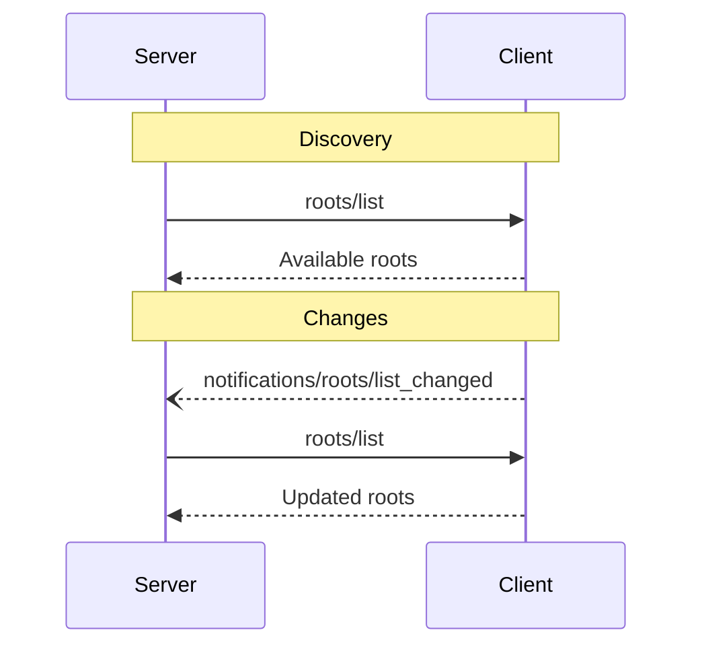

:::info
**协议版本**: 2024-11-05
:::

Model Context Protocol (MCP) 为客户端提供了一种标准化的方式来向服务器暴露文件系统"根目录"（roots）。根目录定义了服务器可以在文件系统中操作的边界，使其了解可以访问哪些目录和文件。服务器可以从支持的客户端请求根目录列表，并在列表发生变化时接收通知。

## 用户交互模型

MCP 中的根目录通常通过工作区或项目配置界面暴露。例如，实现可以提供一个工作区/项目选择器，允许用户选择服务器应该有权访问的目录和文件。这可以与版本控制系统或项目文件的自动工作区检测相结合。

然而，实现可以通过任何适合其需求的界面模式来暴露根目录——协议本身不强制要求任何特定的用户交互模型。

## Capabilities（功能）

支持根目录的客户端必须（**MUST**）在[初始化](/docs/specification/basic/lifecycle#initialization)期间声明 `roots` 功能：

```json
{
  "capabilities": {
    "roots": {
      "listChanged": true
    }
  }
}
```

`listChanged` 表示客户端是否会在根目录列表发生变化时发出通知。

## Protocol Messages（协议消息）

### 列出根目录

要检索根目录，服务器发送 `roots/list` 请求：

请求：
```json
{
  "jsonrpc": "2.0",
  "id": 1,
  "method": "roots/list"
}
```

响应：
```json
{
  "jsonrpc": "2.0",
  "id": 1,
  "result": {
    "roots": [
      {
        "uri": "file:///home/user/projects/myproject",
        "name": "My Project"
      }
    ]
  }
}
```

### 根目录列表变更

当根目录发生变化时，支持 `listChanged` 的客户端必须（**MUST**）发送通知：

```json
{
  "jsonrpc": "2.0",
  "method": "notifications/roots/list_changed"
}
```

## Message Flow（消息流）



## Data Types（数据类型）

### Root（根目录）

根目录定义包括：

- `uri`：根目录的唯一标识符。在当前规范中，这必须（**MUST**）是一个 `file://` URI。
- `name`：可选的人类可读显示名称。

不同用例的根目录示例：

#### 项目目录
```json
{
  "uri": "file:///home/user/projects/myproject",
  "name": "My Project"
}
```

#### 多个仓库
```json
[
  {
    "uri": "file:///home/user/repos/frontend",
    "name": "Frontend Repository"
  },
  {
    "uri": "file:///home/user/repos/backend",
    "name": "Backend Repository"
  }
]
```

## Error Handling（错误处理）

客户端应该（**SHOULD**）为常见失败情况返回标准 JSON-RPC 错误：

- 客户端不支持根目录：`-32601`（Method not found）
- 内部错误：`-32603`

错误示例：
```json
{
  "jsonrpc": "2.0",
  "id": 1,
  "error": {
    "code": -32601,
    "message": "Roots not supported",
    "data": {
      "reason": "Client does not have roots capability"
    }
  }
}
```

## Security Considerations（安全考虑）

1. 客户端必须（**MUST**）：
   - 只暴露具有适当权限的根目录
   - 验证所有根目录 URI 以防止路径遍历
   - 实现适当的访问控制
   - 监控根目录可访问性

2. 服务器应该（**SHOULD**）：
   - 处理根目录变得不可用的情况
   - 在操作期间尊重根目录边界
   - 根据提供的根目录验证所有路径

## Implementation Guidelines（实现指南）

1. 客户端应该（**SHOULD**）：
   - 在向服务器暴露根目录之前请求用户同意
   - 提供清晰的根目录管理用户界面
   - 在暴露之前验证根目录可访问性
   - 监控根目录变化

2. 服务器应该（**SHOULD**）：
   - 在使用前检查根目录功能
   - 优雅地处理根目录列表变化
   - 在操作中尊重根目录边界
   - 适当缓存根目录信息
