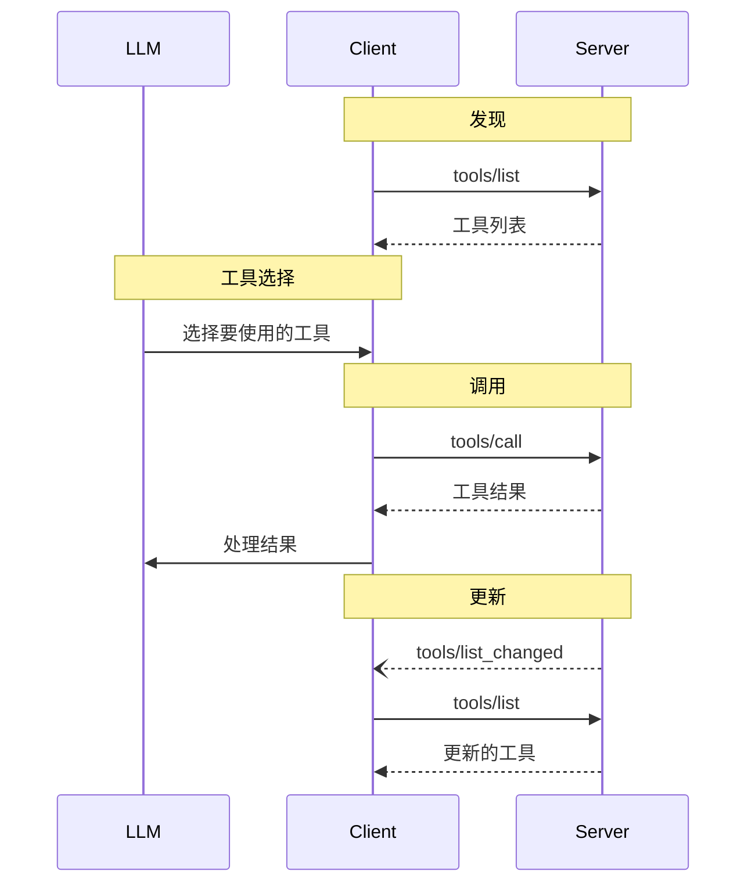

 **协议版本**: 


Model Context Protocol (MCP) 允许服务器暴露可由语言模型调用的工具。Tools 使模型能够与外部系统交互，例如查询数据库、调用 API 或执行计算。每个工具都由名称唯一标识，并包含描述其模式的元数据。

## 用户交互模型

MCP 中的工具被设计为 **model-controlled**（模型控制），这意味着语言模型可以基于其上下文理解和用户提示自动发现和调用工具。

然而，实现者可以自由地通过任何适合其需求的界面模式来暴露工具——协议本身不强制要求特定的用户交互模型。

 出于信任、安全和安全性考虑，**SHOULD** 始终有人类参与循环，能够拒绝工具调用。

应用程序 **SHOULD**：

- 提供清晰显示哪些工具暴露给 AI 模型的 UI
- 在工具被调用时插入清晰的视觉指示器
- 向用户呈现操作确认提示，以确保有人类参与循环 

## 功能

支持工具的服务器 **MUST** 声明 `tools` 功能：

```json
{
  "capabilities": {
    "tools": {
      "listChanged": true
    }
  }
}
```

`listChanged` 表示服务器是否会在可用工具列表发生变化时发出通知。

## 协议消息

### 列出工具

要检索可用工具，客户端发送 `tools/list` 请求。此操作支持 [分页]()。

**请求：**

```json
{
  "jsonrpc": "2.0",
  "id": 1,
  "method": "tools/list",
  "params": {
    "cursor": "optional-cursor-value"
  }
}
```

**响应：**

```json
{
  "jsonrpc": "2.0",
  "id": 1,
  "result": {
    "tools": [
      {
        "name": "get-weather",
        "description": "获取指定位置的天气信息",
        "inputSchema": {
          "type": "object",
          "properties": {
            "location": {
              "type": "string",
              "description": "城市名称"
            }
          },
          "required": ["location"]
        }
      }
    ],
    "nextCursor": "next-page-cursor"
  }
}
```

### 调用工具

要执行工具，客户端发送 `tools/call` 请求：

**请求：**

```json
{
  "jsonrpc": "2.0",
  "id": 2,
  "method": "tools/call",
  "params": {
    "name": "get-weather",
    "input": {
      "location": "北京"
    }
  }
}
```

**响应：**

```json
{
  "jsonrpc": "2.0",
  "id": 2,
  "result": {
    "content": [
      {
        "type": "text",
        "text": "北京当前天气：\n温度：25°C\n天气状况：晴朗"
      }
    ],
    "isError": false
  }
}
```

### 列表变更通知

当可用工具列表发生变化时，声明了 `listChanged` 功能的服务器 **SHOULD** 发送通知：

```json
{
  "jsonrpc": "2.0",
  "method": "notifications/tools/list_changed"
}
```

## 消息流



## 数据类型

### Tool

工具定义包括：

- `name`：工具的唯一标识符
- `description`：功能的人类可读描述
- `inputSchema`：定义预期参数的 JSON Schema

### Tool Result

工具结果可以包含不同类型的多个内容项：

#### Text Content

```json
{
  "type": "text",
  "text": "工具结果文本"
}
```

#### Image Content

```json
{
  "type": "image",
  "data": "base64-encoded-data",
  "mimeType": "image/png"
}
```

#### Embedded Resources

可以嵌入 [Resources]()，以提供额外的上下文或数据，通过客户端稍后可以订阅或再次获取的 URI：

```json
{
  "type": "resource",
  "resource": {
    "uri": "resource://example",
    "mimeType": "text/plain",
    "text": "资源内容"
  }
}
```

## 错误处理

工具使用两种错误报告机制：

1. **Protocol Errors**：标准 JSON-RPC 错误，用于以下情况：

   - 未知工具
   - 无效参数
   - 服务器错误

2. **Tool Execution Errors**：在工具结果中报告，设置 `isError: true`：
   - API 失败
   - 无效输入数据
   - 业务逻辑错误

协议错误示例：

```json
{
  "jsonrpc": "2.0",
  "id": 3,
  "error": {
    "code": -32602,
    "message": "未知工具：invalid_tool_name"
  }
}
```

工具执行错误示例：

```json
{
  "jsonrpc": "2.0",
  "id": 4,
  "result": {
    "content": [
      {
        "type": "text",
        "text": "获取天气数据失败：API 速率限制已超出"
      }
    ],
    "isError": true
  }
}
```

## 安全注意事项

1. 服务器 **MUST**：

   - 验证所有工具输入
   - 实现适当的访问控制
   - 限制工具调用速率
   - 净化工具输出

2. 客户端 **SHOULD**：
   - 对敏感操作提示用户确认
   - 在调用服务器之前向用户显示工具输入，以避免恶意或意外的数据泄露
   - 在传递给 LLM 之前验证工具结果
   - 为工具调用实现超时
   - 记录工具使用情况以供审计
